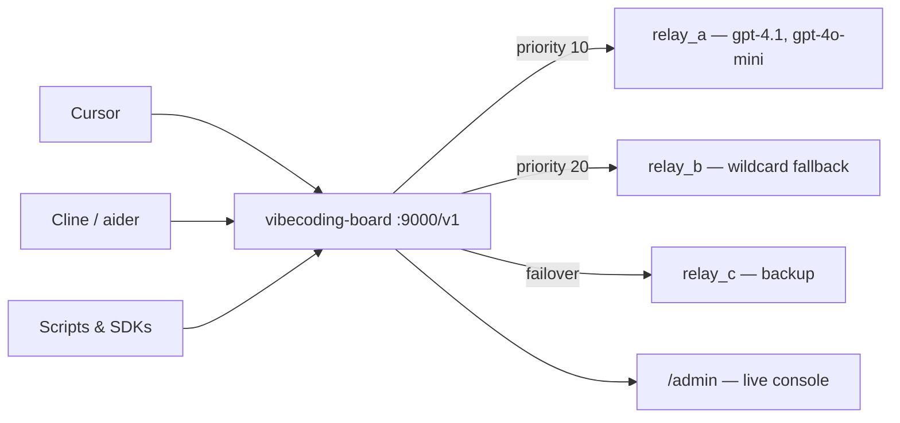

# vibecoding-board

**Stop juggling API keys and base URLs. One local endpoint, all your providers.**

Local OpenAI-compatible aggregation proxy with automatic failover, model-aware routing, and a real-time admin console.

[Quick Start](#quick-start) · [Features](#features) · [Admin UI](#admin-ui) · [Configuration](#configuration) · [中文说明](README.zh-CN.md)

---

## The Problem

You have Cursor, Cline, aider, custom scripts — all talking to OpenAI-compatible APIs. You also have multiple relay providers for redundancy or cost reasons. Every time you switch providers, you update `base_url` and `api_key` in five different places. When one provider goes down at 2 AM, your automation silently breaks.

## The Solution

Point everything at `http://127.0.0.1:9000/v1` once. vibecoding-board handles the rest:



- Provider A goes down? Requests fail over to B automatically — even mid-stream before the first token arrives.
- Need to add a provider? Do it from the admin UI. No restart, no config file editing. Hot-reloaded instantly.
- Want to know what happened? Open the traffic page and see every request, every failover attempt, every timing.

## Quick Start

**Requirements:** Python 3.12+ and [uv](https://docs.astral.sh/uv/)

```bash
# Install
git clone https://github.com/anthropics/vibecoding-board.git
cd vibecoding-board
uv sync

# Configure
cp config.example.yaml config.yaml
# Edit config.yaml: set your upstream base_url and api_key values

# Run
uv run vibecoding-board --config config.yaml
```

Windows PowerShell:

```powershell
git clone https://github.com/anthropics/vibecoding-board.git
cd vibecoding-board
uv sync
Copy-Item config.example.yaml config.yaml
# Edit config.yaml: set your upstream base_url and api_key values
uv run vibecoding-board --config config.yaml
```

That's it. Three endpoints are now live:

| Endpoint | Purpose |
| -------- | ------- |
| `http://127.0.0.1:9000/v1` | Drop-in OpenAI-compatible proxy — point your tools here |
| `http://127.0.0.1:9000/admin/` | Live admin console |
| `http://127.0.0.1:9000/healthz` | Health check |

**Tip:** If your SDK requires an API key for the local endpoint, any non-empty string works. The proxy injects real provider keys server-side.

### Verify It Works

```bash
# Health check
curl http://127.0.0.1:9000/healthz

# List available models
curl http://127.0.0.1:9000/v1/models

# Send a request
curl http://127.0.0.1:9000/v1/chat/completions \
  -H "Content-Type: application/json" \
  -d '{"model": "gpt-4.1", "messages": [{"role": "user", "content": "hello"}]}'
```

## Features

### Drop-in Compatibility

Works with any tool that speaks the OpenAI API — Cursor, Cline, aider, Continue, Open Interpreter, LangChain, OpenAI SDK, or plain `curl`. Supports both `/v1/chat/completions` and `/v1/responses`.

### Smart Routing

Providers are matched by model support first, then ordered by priority. Use explicit model lists for primary providers, `models: ["*"]` for catch-all fallbacks.

### Automatic Failover

When an upstream returns `429`, `502`, or other retryable errors:

1. **Same-provider retry** — configurable retry count before giving up on the current provider
2. **Cross-provider failover** — moves to the next provider by priority
3. **Streaming failover** — even streaming requests can fail over, as long as the first token hasn't been sent to the client yet

### Circuit Breaker

Providers that keep failing enter a cooldown period. They come back automatically after `cooldown_seconds`. Providers marked **always-alive** skip cooldown entirely — useful for your most critical relay.

### Hot-Reload Everything

Every change from the admin UI — add provider, change priority, toggle enable/disable, update retry policy — writes back to `config.yaml` and takes effect immediately. No process restart needed.

### Built-in Observability

- Recent request log with per-attempt failover traces
- Hourly metrics persisted to disk with trend charts
- Per-provider traffic breakdown and success rates
- All in the browser, no Grafana or Prometheus setup required

## Admin UI

The admin console is a full operational workspace, not a status page.

### Overview

Global health, preferred provider, key metrics, recent traffic preview, and hourly trend charts — all on one screen.

### Providers

Add, edit, delete, enable/disable, reprioritize, promote-to-primary, toggle always-alive, and run manual health checks (standard or streaming mode) — per provider.

### Traffic

Inspect every proxied request: model, provider, HTTP status, duration, TTFB, token usage, and the full fallback attempt chain.

### Settings

Tune retryable status codes, same-provider retry count, retry interval, and global healthcheck transport mode.

> **Security:** Saved API keys are never returned from the backend to the browser. The admin UI can submit new keys, but stored secrets stay server-side.
> **i18n:** Full English and Chinese UI. Light and dark themes with system preference detection.

## How Routing Works

```text
Request arrives with model: "gpt-4.1"
  │
  ├─ Filter: which providers support "gpt-4.1"?
  │    ├─ relay_a (explicit: gpt-4.1, gpt-4o-mini)  ✓
  │    ├─ relay_b (wildcard: *)                       ✓
  │    └─ relay_c (explicit: claude-sonnet-4-20250514)        ✗
  │
  ├─ Sort by priority (lower = first)
  │    ├─ relay_a  priority 10  → try first
  │    └─ relay_b  priority 20  → fallback
  │
  ├─ Try relay_a
  │    ├─ Success → return response
  │    ├─ Retryable error (429, 5xx) → same-provider retry if budget remains
  │    └─ Exhausted → fail over to relay_b
  │
  └─ All providers exhausted → return 503 with attempt details
```

- **Non-streaming:** Full retry + failover chain before returning to the client.
- **Streaming:** Failover only before the first chunk. After streaming starts, interruptions are logged but not replayed — clients see partial output rather than silent replay to another provider.

## Configuration

See [config.example.yaml](config.example.yaml) for a fully commented example.

```yaml
listen:
  host: 127.0.0.1
  port: 9000

retry_policy:
  retryable_status_codes: [429, 500, 502, 503, 504]
  same_provider_retry_count: 0     # extra retries on the same provider
  retry_interval_ms: 0             # delay between same-provider retries

healthcheck:
  stream: false                    # true = streaming healthchecks

providers:
  - name: relay_a
    base_url: https://relay-a.example.com/v1
    api_key: env:RELAY_A_API_KEY   # reads from environment variable
    enabled: true
    priority: 10                   # lower = tried first
    models: [gpt-4.1, gpt-4o-mini]
    timeout_seconds: 60
    max_failures: 3                # failures before cooldown
    cooldown_seconds: 30

  - name: relay_b
    base_url: https://relay-b.example.com/v1
    api_key: env:RELAY_B_API_KEY
    enabled: true
    priority: 20
    models: ["*"]                  # wildcard: serves any model
    healthcheck_model: gpt-4o-mini # required for wildcard health checks
    timeout_seconds: 60
    max_failures: 3
    cooldown_seconds: 30
```

**Key notes:**

- `api_key: env:NAME` reads secrets from environment variables — never commit real keys.
- Wildcard providers need `healthcheck_model` for manual health checks to work.
- `GET /v1/models` returns the union of explicit models from all enabled providers.
- Priorities are normalized on startup to keep consistent spacing.

## Who It's For

| Scenario | How vibecoding-board helps |
| -------- | ------------------------- |
| **Solo developer** with Cursor + scripts + CLI tools | One `base_url` everywhere. Switch providers by changing priority in the admin UI. |
| **Small team** sharing relay access | Centralized routing with failover. See who's using what in the traffic page. |
| **Multi-provider setup** for cost or redundancy | Automatic failover between providers. Primary goes down, backup takes over. |
| **Provider evaluation** | Compare latency and reliability across providers with built-in metrics. |

## Development

```bash
# Backend
uv run vibecoding-board --config config.yaml
uv run pytest

# Frontend (admin UI)
cd web
npm install
npm run dev      # dev server with HMR
npm run build    # production build → vibecoding_board/static/admin/
npm run lint
```

## Project Structure

```text
vibecoding_board/          # Python backend (FastAPI)
  ├── app.py               # Application factory and route wiring
  ├── service.py           # Proxy logic, failover, streaming
  ├── registry.py          # Provider state, cooldown, candidate selection
  ├── runtime.py           # Hot-reload runtime manager
  ├── config.py            # YAML config parsing and validation
  ├── admin_api.py         # Admin REST endpoints
  ├── admin_metrics.py     # Hourly metrics store
  └── static/admin/        # Built frontend assets
web/src/                   # React + TypeScript frontend
  ├── App.tsx              # Shell, navigation, state management
  ├── api.ts               # Backend API client
  ├── components/          # OverviewView, ProvidersView, TrafficView, ...
  └── i18n.tsx             # English + Chinese message catalogs
config.example.yaml        # Annotated starter config
```

## License

MIT
