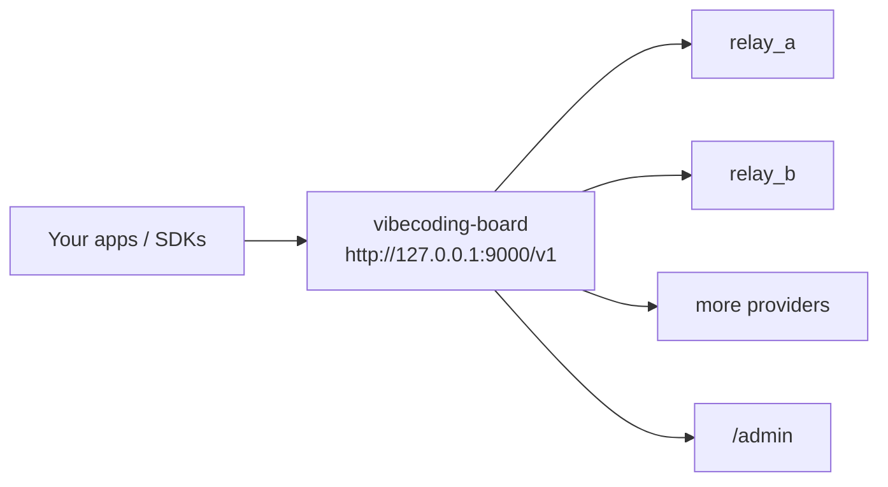

# vibecoding-board

Local OpenAI-compatible aggregation proxy with failover, model-aware routing, and a built-in admin UI.

[中文说明](README.zh-CN.md)

`vibecoding-board` is for the moment when one relay is no longer enough. Keep every client pointed at one local `/v1` endpoint, then manage multiple upstream providers behind it without changing SDK settings every time.



## Why People Use It

- One local OpenAI-compatible endpoint instead of manually switching base URLs across tools and SDKs.
- Routing by model support and provider priority, so explicit providers and wildcard fallbacks can live in one place.
- Automatic failover for retryable upstream problems, including streaming failover before the first chunk arrives.
- A built-in admin console for provider management, health checks, routing tweaks, and traffic inspection.
- Local-first operations: configuration stays in `config.yaml`, recent traffic stays in memory, and hourly metrics are written to disk.

## Quick Start

Requirements: Python 3.12+ and [`uv`](https://docs.astral.sh/uv/).

1. Clone the repository and install dependencies.
2. Copy `config.example.yaml` to `config.yaml`.
3. Point each provider at an OpenAI-compatible upstream and set its API key.
4. Start the proxy and open the admin UI.

```bash
uv sync --extra dev
cp config.example.yaml config.yaml
export RELAY_A_API_KEY="your-key-a"
export RELAY_B_API_KEY="your-key-b"
uv run vibecoding-board --config config.yaml
```

```powershell
uv sync --extra dev
Copy-Item config.example.yaml config.yaml
$env:RELAY_A_API_KEY="your-key-a"
$env:RELAY_B_API_KEY="your-key-b"
uv run vibecoding-board --config config.yaml
```

Once it is running:

- Proxy base URL: `http://127.0.0.1:9000/v1`
- Admin UI: `http://127.0.0.1:9000/admin/`
- Health check: `http://127.0.0.1:9000/healthz`

If your SDK insists on an API key for the local endpoint, any non-empty placeholder string is fine. The proxy injects the real upstream provider keys server-side.

## Try It

```bash
curl http://127.0.0.1:9000/healthz
curl http://127.0.0.1:9000/v1/models
curl http://127.0.0.1:9000/v1/chat/completions \
  -H "Content-Type: application/json" \
  -d '{
    "model": "gpt-4.1",
    "messages": [{"role": "user", "content": "hello"}]
  }'
```

## What You Get

- `POST /v1/chat/completions`
- `POST /v1/responses`
- `GET /v1/models`
- `GET /healthz`
- Model-aware routing across multiple providers
- Retryable-status failover on `429` and configured `5xx` responses
- Optional same-provider retries before moving to the next provider
- Simple cooldown-based circuit breaker for repeated retryable failures
- Built-in admin UI at `/admin`
- Recent request inspection with attempt-by-attempt fallback traces
- Hourly charts and aggregated metrics persisted to `./data/metrics/admin_hourly.json`
- English and Chinese UI, plus light/dark theme preference

## How Routing And Failover Work

- Providers are filtered by model support first, then ordered by priority. Lower `priority` values are tried first.
- `models: ["*"]` can act as a catch-all fallback for anything not handled by an explicit provider.
- Non-streaming requests can retry the same provider first, then fail over to the next provider if the retry budget is exhausted.
- Streaming requests can fail over only before the first chunk is returned to the client. After the stream starts, an interruption is logged and surfaced instead of replaying the request elsewhere.
- Providers that keep failing with retryable errors enter cooldown for `cooldown_seconds`, then become eligible again automatically.

## Admin UI

The admin console is built for day-two operations, not just demos.

- Overview page with proxy endpoint, primary provider, and high-level metrics
- Provider management for add, edit, delete, enable, disable, reprioritize, and promote-to-primary flows
- Manual health checks per provider, using either standard or streaming validation
- Traffic view with request state, duration, TTFB, usage fields, and fallback attempt history
- Settings page for retry policy and global manual health-check mode
- Language switching between English and Chinese
- Saved API keys are never echoed back from the backend to the browser

Management changes are written back to `config.yaml` and hot-reloaded into the running proxy.

## Configuration Example

See [config.example.yaml](config.example.yaml) for the full example.

```yaml
listen:
  host: 127.0.0.1
  port: 9000

retry_policy:
  retryable_status_codes: [429, 500, 502, 503, 504]
  same_provider_retry_count: 0
  retry_interval_ms: 0

healthcheck:
  stream: false

providers:
  - name: relay_a
    base_url: https://relay-a.example.com/v1
    api_key: env:RELAY_A_API_KEY
    enabled: true
    priority: 10
    models: [gpt-4.1, gpt-4o-mini]
    timeout_seconds: 60
    max_failures: 3
    cooldown_seconds: 30

  - name: relay_b
    base_url: https://relay-b.example.com/v1
    api_key: env:RELAY_B_API_KEY
    enabled: true
    priority: 20
    models: ["*"]
    healthcheck_model: gpt-4o-mini
    timeout_seconds: 60
    max_failures: 3
    cooldown_seconds: 30
```

Important notes:

- `base_url` should point at the upstream API root, usually ending in `/v1`.
- `api_key: env:NAME` reads provider credentials from the environment instead of committing secrets into the repo.
- Wildcard providers should set `healthcheck_model`, because manual health checks need a concrete model name.
- Priorities are normalized on load and save to keep spacing consistent while preserving relative order.
- `GET /v1/models` advertises the union of explicit models from enabled providers. Wildcard-only support is not expanded into a giant synthetic model list.

## Operational Notes

- Recent request history is in-memory only. It is useful for live inspection, not long-term audit storage.
- Hourly metrics are persisted locally for charts and aggregated summaries.
- The project is designed for local workflows and small-team internal gateways, not as a globally distributed edge proxy.
- Existing provider secrets stay server-side; the admin UI can submit new secrets, but stored secrets are not returned in dashboard payloads.

## Good Fits

- Personal local gateway for coding tools, scripts, or desktop apps that should always talk to one stable `/v1` endpoint
- Small-team relay router that needs quick failover and an admin console without introducing a database
- Self-hosted experimentation setup where you want to compare providers, keep a backup relay ready, and inspect what happened when a request failed

## Development

Backend:

```bash
uv run vibecoding-board --config config.yaml
uv run pytest
```

Frontend:

```bash
cd web
npm install --cache .npm-cache
npm run dev
npm run lint
npm run build
```

The built admin assets are served from `vibecoding_board/static/admin`. Edit the source in `web/src/`, then rebuild instead of editing bundled files by hand.

## Project Notes

- Example config: [config.example.yaml](config.example.yaml)
- Admin frontend source: [web/src](web/src)
- Design specs: [docs/superpowers/specs](docs/superpowers/specs)
