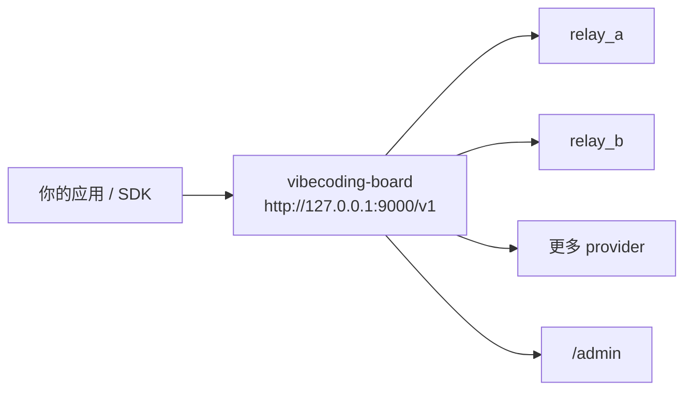

# vibecoding-board

带故障切换、模型路由和内置管理后台的本地 OpenAI 兼容聚合代理。

[English README](README.md)

`vibecoding-board` 适合这样一种场景：你的客户端、脚本、IDE 插件和自动化工具都希望只连一个稳定的 `/v1` 地址，但你背后实际上有多个 OpenAI 兼容上游，希望按模型、优先级、健康状态来路由，并且在上游不稳定时自动切换。



## 这个项目为什么值得用

- 只给所有客户端配置一个本地 OpenAI 兼容入口，不需要来回切换 `base_url`。
- 支持按模型能力和优先级路由，把显式模型 provider 和通配 fallback provider 放在同一个控制面里。
- 上游出现可重试错误时可以自动切换；流式请求在首包到来前也可以切换。
- 自带 `/admin` 管理后台，不只是看状态，还能直接改 provider、改优先级、做健康检查、看流量。
- 本地优先，不依赖数据库：配置写回 `config.yaml`，近期请求放内存，小时级指标落盘。

## 快速开始

环境要求：Python 3.12+，以及 [`uv`](https://docs.astral.sh/uv/)。

1. 安装依赖。
2. 复制配置文件。
3. 填入你的上游地址和 API Key。
4. 启动代理并打开后台。

```bash
uv sync --extra dev
cp config.example.yaml config.yaml
export RELAY_A_API_KEY="your-key-a"
export RELAY_B_API_KEY="your-key-b"
uv run vibecoding-board --config config.yaml
```

```powershell
uv sync --extra dev
Copy-Item config.example.yaml config.yaml
$env:RELAY_A_API_KEY="your-key-a"
$env:RELAY_B_API_KEY="your-key-b"
uv run vibecoding-board --config config.yaml
```

启动后默认地址：

- 代理入口：`http://127.0.0.1:9000/v1`
- 管理后台：`http://127.0.0.1:9000/admin/`
- 健康检查：`http://127.0.0.1:9000/healthz`

如果你的 SDK 强制要求本地也填写一个 API Key，可以随便填一个非空占位值。真正发往上游的密钥由代理在服务端注入。

## 先跑一个请求试试

```bash
curl http://127.0.0.1:9000/healthz
curl http://127.0.0.1:9000/v1/models
curl http://127.0.0.1:9000/v1/chat/completions \
  -H "Content-Type: application/json" \
  -d '{
    "model": "gpt-4.1",
    "messages": [{"role": "user", "content": "hello"}]
  }'
```

## 它已经提供了什么

- `POST /v1/chat/completions`
- `POST /v1/responses`
- `GET /v1/models`
- `GET /healthz`
- 多 provider 的模型感知路由
- 遇到 `429` 和已配置 `5xx` 时的自动切换
- 同一 provider 先重试、再切到下一个 provider 的策略
- 基于失败次数和冷却时间的简单熔断
- 内置 `/admin` 管理界面
- 近期请求查看，包含每次 fallback 尝试的轨迹
- 小时级图表和聚合指标，持久化到 `./data/metrics/admin_hourly.json`
- 管理界面中英文切换，以及明暗主题偏好

## 路由与故障切换规则

- 先按模型支持筛选 provider，再按 `priority` 排序，数值越小越优先。
- `models: ["*"]` 可以作为兜底 provider，承接没有被显式 provider 命中的模型。
- 非流式请求可以先在同一 provider 上重试，重试预算耗尽后再切到下一个 provider。
- 流式请求只能在首个 chunk 返回给客户端之前切换。一旦首包已经发出，后续中断会被记录并返回客户端，而不会偷偷重放到其他 provider。
- 某个 provider 持续出现可重试错误时，会进入 `cooldown_seconds` 指定的冷却期，之后自动恢复参与路由。

## 管理后台

这个后台不是展示页，而是日常运维入口。

- Overview 页面展示代理入口、主 provider、统计概览和趋势指标
- Providers 页面支持新增、编辑、删除、启用、停用、改优先级、提升为主路由
- 支持单个 provider 手动健康检查，可选普通模式或流式模式
- Traffic 页面展示请求状态、耗时、TTFB、usage 字段和 fallback 轨迹
- Settings 页面支持修改 retry policy 和全局健康检查模式
- 支持英文和中文界面切换
- 已保存的 API Key 不会从后端回传到浏览器

所有管理操作都会写回 `config.yaml`，并对正在运行的代理进行热重载。

## 配置示例

完整示例见 [config.example.yaml](config.example.yaml)。

```yaml
listen:
  host: 127.0.0.1
  port: 9000

retry_policy:
  retryable_status_codes: [429, 500, 502, 503, 504]
  same_provider_retry_count: 0
  retry_interval_ms: 0

healthcheck:
  stream: false

providers:
  - name: relay_a
    base_url: https://relay-a.example.com/v1
    api_key: env:RELAY_A_API_KEY
    enabled: true
    priority: 10
    models: [gpt-4.1, gpt-4o-mini]
    timeout_seconds: 60
    max_failures: 3
    cooldown_seconds: 30

  - name: relay_b
    base_url: https://relay-b.example.com/v1
    api_key: env:RELAY_B_API_KEY
    enabled: true
    priority: 20
    models: ["*"]
    healthcheck_model: gpt-4o-mini
    timeout_seconds: 60
    max_failures: 3
    cooldown_seconds: 30
```

关键说明：

- `base_url` 一般应该指向上游 API 根路径，通常以 `/v1` 结尾。
- `api_key: env:NAME` 表示从环境变量读取密钥，避免把真实密钥写进仓库。
- 通配模型 provider 建议显式设置 `healthcheck_model`，否则后台手动健康检查没有具体模型可测。
- 启动和保存配置时，系统会规范化 priority 的间隔，但会保持相对顺序不变。
- `GET /v1/models` 返回的是已启用 provider 中显式模型的并集，不会把通配 provider 扩展成一大串虚构模型名。

## 行为边界与注意事项

- 近期请求记录只保存在内存里，适合排查实时问题，不适合作为长期审计日志。
- 小时级指标会持久化到本地文件，用于图表和聚合统计。
- 这个项目更适合本地工作流、自建中转和小团队内部网关，不是面向全球边缘节点的超大规模网关。
- 浏览器端可以提交新的密钥，但后端不会把已保存的密钥重新回显到 dashboard 响应里。
- 如果你很依赖流式输出，需要理解一个边界：只有在首包前才能切换，首包后不会自动“无损接续”到别的 provider。

## 适合哪些场景

- 个人开发者希望给 IDE、脚本、桌面客户端统一一个稳定的 `/v1` 地址
- 小团队需要把多个 OpenAI 兼容中转聚合成一个可管理、可切换、可观察的本地网关
- 自建代理链路里需要一个轻量控制台，可以快速知道请求失败在哪个 provider、是否发生过 fallback、当前谁是主路由

## 开发与测试

后端：

```bash
uv run vibecoding-board --config config.yaml
uv run pytest
```

前端：

```bash
cd web
npm install --cache .npm-cache
npm run dev
npm run lint
npm run build
```

构建后的管理后台静态资源位于 `vibecoding_board/static/admin`。如果修改前端源码，请在 `web/src/` 中开发并重新构建，不要直接改打包产物。

## 项目索引

- 配置示例：[config.example.yaml](config.example.yaml)
- 管理后台源码：[web/src](web/src)
- 设计文档：[docs/superpowers/specs](docs/superpowers/specs)
