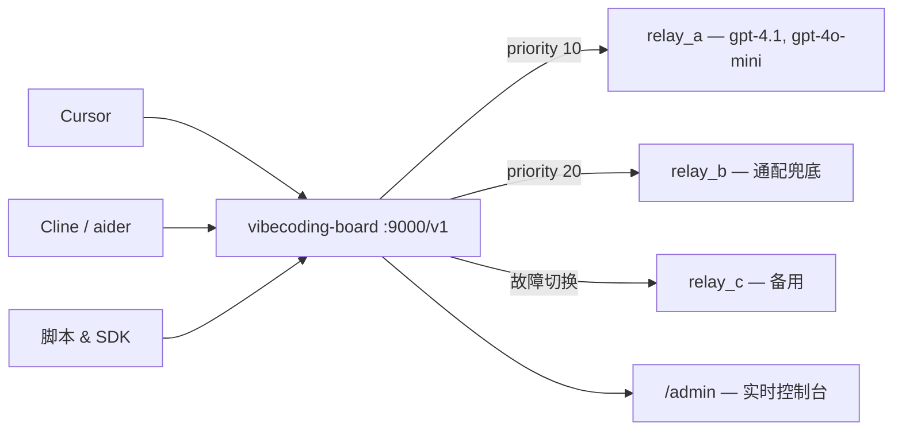

# vibecoding-board

**别再到处改 API Key 和 base URL 了。一个本地入口，管好所有上游。**

带自动故障切换、模型感知路由和实时管理后台的本地 OpenAI 兼容聚合代理。

[快速开始](#快速开始) · [核心能力](#核心能力) · [管理后台](#管理后台) · [配置说明](#配置说明) · [English](README.md)

---

## 痛点

你有 Cursor、Cline、aider、各种脚本——全都在调 OpenAI 兼容接口。你还有好几个中转 provider，用来做冗余或者省钱。每次切 provider，要改五个地方的 `base_url` 和 `api_key`。某个 provider 凌晨两点挂了，你的自动化悄无声息地全部失败。

## 解法

所有工具只配一次 `http://127.0.0.1:9000/v1`，剩下的交给 vibecoding-board：



- Provider A 挂了？请求自动切到 B——流式请求在首个 token 发出前也能切。
- 要加个新 provider？在管理后台加就行，不用重启，不用改配置文件，热加载即时生效。
- 想知道发生了什么？打开 Traffic 页，每个请求、每次 failover 尝试、每个耗时一目了然。

## 快速开始

**环境要求：** Python 3.12+ 和 [uv](https://docs.astral.sh/uv/)

```bash
# 安装
git clone https://github.com/anthropics/vibecoding-board.git
cd vibecoding-board
uv sync

# 配置
cp config.example.yaml config.yaml
# 编辑 config.yaml：填入你的上游 base_url 和 api_key

# 启动
uv run vibecoding-board --config config.yaml
```

Windows PowerShell：

```powershell
git clone https://github.com/anthropics/vibecoding-board.git
cd vibecoding-board
uv sync
Copy-Item config.example.yaml config.yaml
# 编辑 config.yaml：填入你的上游 base_url 和 api_key
uv run vibecoding-board --config config.yaml
```

启动后有三个入口可用：

| 地址 | 用途 |
| ---- | ---- |
| `http://127.0.0.1:9000/v1` | OpenAI 兼容代理——把你的工具指向这里 |
| `http://127.0.0.1:9000/admin/` | 实时管理后台 |
| `http://127.0.0.1:9000/healthz` | 健康检查 |

**提示：** 如果你的 SDK 要求本地入口也填 API Key，随便填一个非空字符串就行。真正的上游密钥由代理在服务端注入。

### 跑个请求试试

```bash
# 健康检查
curl http://127.0.0.1:9000/healthz

# 查看可用模型
curl http://127.0.0.1:9000/v1/models

# 发个请求
curl http://127.0.0.1:9000/v1/chat/completions \
  -H "Content-Type: application/json" \
  -d '{"model": "gpt-4.1", "messages": [{"role": "user", "content": "hello"}]}'
```

## 核心能力

### 即插即用

兼容一切支持 OpenAI API 的工具——Cursor、Cline、aider、Continue、Open Interpreter、LangChain、OpenAI SDK，或者直接 `curl`。同时支持 `/v1/chat/completions` 和 `/v1/responses`。

### 智能路由

先按模型支持筛选 provider，再按优先级排序。主力 provider 用显式模型列表，`models: ["*"]` 做通配兜底。

### 自动故障切换

当上游返回 `429`、`502` 或其他可重试错误时：

1. **同 provider 重试** — 可配置重试次数，先在当前 provider 上再试几次
2. **跨 provider 切换** — 当前 provider 用尽预算后，自动切到下一个
3. **流式切换** — 流式请求在首个 token 发给客户端之前也能切换

### 熔断保护

持续失败的 provider 会进入冷却期，`cooldown_seconds` 后自动恢复。标记为**始终存活**的 provider 跳过冷却——适合你最关键的那个中转。

### 全量热重载

在管理后台做的每个操作——加 provider、改优先级、启停、改重试策略——都会写回 `config.yaml` 并立即生效，不需要重启进程。

### 内建可观测性

- 近期请求日志，每次 failover 尝试都有完整轨迹
- 小时级指标持久化到磁盘，带趋势图表
- 按 provider 拆分的流量和成功率
- 全部在浏览器里看，不需要装 Grafana 或 Prometheus

## 管理后台

这个后台是真正的运维工作台，不是演示页。

### Overview（总览）

全局健康状态、首选 provider、关键指标、近期流量预览、小时级趋势图——一屏掌握。

### Providers

逐个 provider 操作：新增、编辑、删除、启停、改优先级、提升为首选、切换始终存活、手动健康检查（普通或流式）。

### Traffic（流量）

检查每个被代理的请求：模型、provider、HTTP 状态码、耗时、TTFB、token 用量，以及完整的 failover 尝试链。

### Settings（设置）

调整可重试状态码、同 provider 重试次数、重试间隔、全局健康检查传输模式。

> **安全性：** 已保存的 API Key 不会从后端回传到浏览器。管理界面可以提交新密钥，但存储的密钥始终留在服务端。
> **多语言：** 完整的中英文界面。明暗主题自动跟随系统偏好。

## 路由流程

```text
请求到达，model: "gpt-4.1"
  │
  ├─ 筛选：哪些 provider 支持 "gpt-4.1"？
  │    ├─ relay_a（显式：gpt-4.1, gpt-4o-mini）  ✓
  │    ├─ relay_b（通配：*）                       ✓
  │    └─ relay_c（显式：claude-sonnet-4-20250514）        ✗
  │
  ├─ 按 priority 排序（越小越优先）
  │    ├─ relay_a  priority 10  → 先试
  │    └─ relay_b  priority 20  → 兜底
  │
  ├─ 尝试 relay_a
  │    ├─ 成功 → 返回响应
  │    ├─ 可重试错误（429, 5xx）→ 如果还有预算就同 provider 重试
  │    └─ 用尽 → 切到 relay_b
  │
  └─ 全部 provider 用尽 → 返回 503，附带每次尝试的详情
```

- **非流式：** 完整走完重试 + 切换链路后才返回给客户端。
- **流式：** 只在首个 chunk 发出前能切换。一旦开始流式传输，中断会被记录但不会悄悄重放到其他 provider——客户端看到的是部分输出，而不是无声切换。

## 配置说明

完整注释示例见 [config.example.yaml](config.example.yaml)。

```yaml
listen:
  host: 127.0.0.1
  port: 9000

retry_policy:
  retryable_status_codes: [429, 500, 502, 503, 504]
  same_provider_retry_count: 0     # 同 provider 额外重试次数
  retry_interval_ms: 0             # 同 provider 重试间隔

healthcheck:
  stream: false                    # true = 流式健康检查

providers:
  - name: relay_a
    base_url: https://relay-a.example.com/v1
    api_key: env:RELAY_A_API_KEY   # 从环境变量读取
    enabled: true
    priority: 10                   # 越小越优先
    models: [gpt-4.1, gpt-4o-mini]
    timeout_seconds: 60
    max_failures: 3                # 进入冷却前的失败次数
    cooldown_seconds: 30

  - name: relay_b
    base_url: https://relay-b.example.com/v1
    api_key: env:RELAY_B_API_KEY
    enabled: true
    priority: 20
    models: ["*"]                  # 通配：接受任意模型
    healthcheck_model: gpt-4o-mini # 通配 provider 手动检查必填
    timeout_seconds: 60
    max_failures: 3
    cooldown_seconds: 30
```

**关键说明：**

- `api_key: env:NAME` 从环境变量读取密钥——不要把真实密钥提交到仓库。
- 通配 provider 需要设置 `healthcheck_model`，否则手动健康检查没有具体模型可测。
- `GET /v1/models` 返回所有已启用 provider 中显式模型的并集。
- 启动时会自动规范化 priority 间距，但保持相对顺序不变。

## 适合谁

| 场景 | vibecoding-board 怎么帮你 |
| ---- | ---- |
| **个人开发者**，用 Cursor + 脚本 + CLI 工具 | 所有地方只配一个 `base_url`，在后台改优先级就能切 provider |
| **小团队**共享中转 | 集中路由 + 自动 failover，在 Traffic 页看谁在用什么 |
| **多 provider 部署**，为了成本或冗余 | 主力挂了备用自动顶上，不需要人工干预 |
| **评估 provider** | 用内建指标对比各 provider 的延迟和可靠性 |

## 开发

```bash
# 后端
uv run vibecoding-board --config config.yaml
uv run pytest

# 前端（管理后台）
cd web
npm install
npm run dev      # 开发服务器，支持 HMR
npm run build    # 生产构建 → vibecoding_board/static/admin/
npm run lint
```

## 项目结构

```text
vibecoding_board/          # Python 后端（FastAPI）
  ├── app.py               # 应用工厂和路由装配
  ├── service.py           # 代理逻辑、故障切换、流式处理
  ├── registry.py          # Provider 状态、冷却、候选选择
  ├── runtime.py           # 热重载运行时管理器
  ├── config.py            # YAML 配置解析和校验
  ├── admin_api.py         # 管理 REST 端点
  ├── admin_metrics.py     # 小时级指标存储
  └── static/admin/        # 前端构建产物
web/src/                   # React + TypeScript 前端
  ├── App.tsx              # 外壳、导航、状态管理
  ├── api.ts               # 后端 API 客户端
  ├── components/          # OverviewView, ProvidersView, TrafficView, ...
  └── i18n.tsx             # 中英文消息目录
config.example.yaml        # 带注释的配置模板
```

## License

MIT
